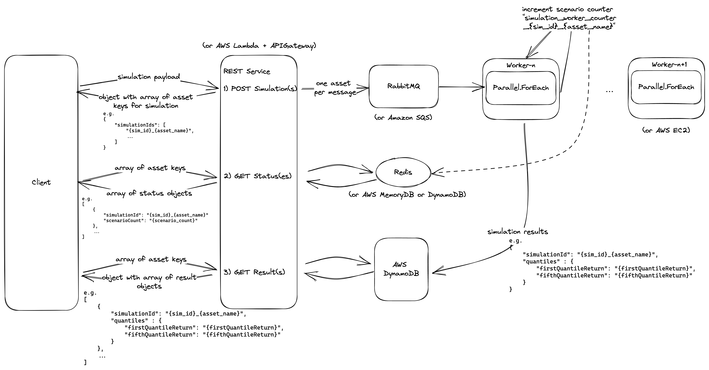

# Welcome to monte-carlo-dotnet!

## How To Run

Clone this repo and start the application with `dotnet run --launch-profile "monte-carlo-simulator"` or open it in your IDE of choice and click 'run'

A Swagger page should then open in your browser running on the port defined in `launchSettings.json` and allow you to interact with these endpoints (e.g. http://localhost:5000/swagger/index.html):

- `POST` `/simulation/start-simulation`
  - Request
    - timeSteps --> number time steps per scenario
    - scenarios --> number of scenarios to run
    - initialPrice --> price at timestep 0
    - mean --> mean
    - standardDeviation --> standard deviation
  ```json
  {
    "timeSteps": 120,
    "scenarios": 1000,
    "assets": [
      {
        "name": "Asset 1",
        "initialPrice": 190.0,
        "mean": "0.5%",
        "standardDeviation": "10%"
      },
      {
        "name": "Asset 2",
        "initialPrice": 100.0,
        "mean": "0.2%",
        "standardDeviation": "1%"
      },
      {
        "name": "Asset 3",
        "initialPrice": 75.25,
        "mean": "0.4%",
        "standardDeviation": "8%"
      }
    ]
  }
  ```
  - Response
    - this contains unique IDs for the Assets simulation runs which can be used in subsequent requests
  ```json
  {
    "simulationIds": [
      "3b1c1277-e9e1-4d3b-8339-a9ca1d4af319_Asset 1",
      "557104d6-0a10-4708-be41-01f2c25e76db_Asset 2",
      "5d0e0586-c85d-4063-b974-208229e87fbd_Asset 3"
    ]
  }
  ```
- `GET` `/simulation/get-statuses`
  - Request
    `https://localhost:7289/simulation/get-statuses?SimulationIds=3b1c1277-e9e1-4d3b-8339-a9ca1d4af319_Asset%201`
  - Response
    - `scenarioCount` counts upward, so 999 means that it's finished
  ```json
  [
    {
      "simulationId": "3b1c1277-e9e1-4d3b-8339-a9ca1d4af319_Asset 1",
      "scenarioCount": 999
    }
  ]
  ```
- `GET` `/simulation/get-results`
  - Request
    `https://localhost:7289/simulation/get-results?SimulationIds=3b1c1277-e9e1-4d3b-8339-a9ca1d4af319_Asset%201`
  - Response
    - As the names suggest, `quantiles` are returned in percentage but as type `double` for the simplicity of those consuming this service
  ```json
  [
    {
      "simulationId": "3b1c1277-e9e1-4d3b-8339-a9ca1d4af319_Asset 1",
      "quantiles": {
        "firstQuantileReturnAsPercentage": 17.390310895879136,
        "fifthQuantileReturnAsPercentage": 21.148225095560502
      }
    }
  ]
  ```
  The `launchSettings.json` file may be configured to your liking if you'd like to change aspects of how the program runs.

### Note(s)

This is a "happy path" service, so please don't try any edge cases as those most likely aren't handled.

You're able to configure how faster the `QueueWorker` runs by configuring its delay `WorkerDelay` in `appsettings.json`. If nothing is provided, the worker will run every `10000 ms`.

## Design Remarks

The `QueueWorker` deliberately handles one message at a time for simplicity and scaling. In the future, you could use n-workers and spawn them as needed to handle a faster throughput.

Also, the interfaces were created to allow for swapping out new components in the future that can take this service to the next level (e.g. the AWS components noted below in the diagram) and for testing of course.

## Further Improvements

- Introduce...
  - FluentValidation for validating requests sent to endpoints
  - NUnit for testing components
  - StyleCop because why not
- Add some more logging perhaps
- Document interfaces, methods, etc
- Migrate toward scalable architecture as defined in diagram below
  - The REST service already communicates in this manner; this diagram is more about showing which components should be introduced to make it faster and scalable



# Happy Monte-Carlo-ing!
